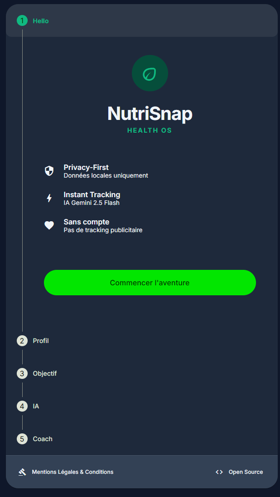
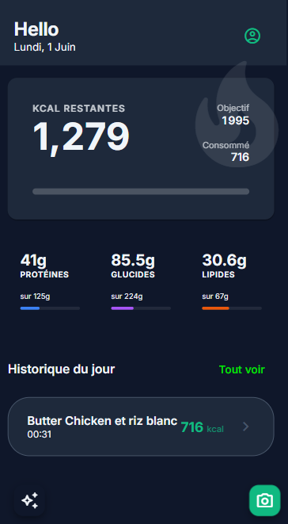

# NutriSnap — Take back control of your plate.

> *We only get one body. And 80% of the work of losing weight, building muscle, or simply feeling better happens at the table — not at the gym.*

Most nutrition apps ask you to create an account, hand over your data, and trust that a remote server keeps your most intimate health information safe. NutriSnap takes the opposite approach: **your data never leaves your device.**

---

## What it does

Snap a photo of your meal. In seconds, Gemini AI identifies the food, estimates calories, and breaks down macronutrients — proteins, carbs, fats. Your daily targets are calculated from your actual metabolic profile (Mifflin-St Jeor or Katch-McArdle, depending on your data). No generic 2000 kcal default.

<p align="center">
  
  &nbsp;&nbsp;&nbsp;
  
</p>

---

## Features

| Feature | Detail |
|---|---|
| **AI meal scanning** | Photo → Gemini 2.5 Flash → calories + macros in seconds |
| **Metabolic engine** | BMR, TDEE, macro targets calculated from your actual profile |
| **Daily AI recap** | Coach summary of your day, cached locally — no repeat calls |
| **Multi-day analysis** | 7-day or 30-day trend analysis with AI coaching |
| **Meal history** | Monthly calendar with color-coded daily intake |
| **Meal detail** | Photo, macros, AI summary and coach tip per meal |
| **Privacy-first** | Zero server, zero telemetry, zero account — IndexedDB only |
| **PWA** | Installable on iOS & Android, works offline |
| **Dark / Light / System** | Theme persisted per device |
| **FR / EN** | Language switch in profile settings |
| **BYOK** | Bring your own Gemini API key — free tier available |

---

## Privacy model

NutriSnap has no backend. There is no server to breach, no database to leak, no account to compromise.

- **All data** (profile, meals, photos, settings) lives in IndexedDB on your browser.
- **The only external call** is to the Google Gemini API — initiated by you, using your own key, at the moment of each meal scan.
- **No cookies**, no analytics, no third-party SDKs beyond the Gemini client library.

The full privacy policy is available in-app at `/privacy`.

---

## Getting started

### Prerequisites
- Node.js 18+
- A [Google Gemini API key](https://aistudio.google.com/welcome) (free tier available)

### Local development

```bash
git clone https://github.com/your-username/nutrisnap.git
cd nutrisnap
npm install
npm run start        # ng serve — dev mode, no service worker
```

### Deploy to a static host (OVH, Netlify, etc.)

```bash
npm run build        # production build → dist/nutrisnap/browser/
```

The build output is a static SPA. Drop it on any HTTPS host. The included `.htaccess` handles SPA routing and PWA cache-busting headers for Apache.

**Auto-deploy to OVH via FTP** (requires a `.env` file with FTP credentials):
```bash
cp .env.example .env   # fill in your FTP credentials
npm run start:sync-prod
```

This watches for file changes, rebuilds in production mode, and syncs to FTP automatically.

---

## Stack

| Layer | Tech |
|---|---|
| Framework | Angular 21 (standalone components, signals) |
| UI | Angular Material 3 |
| Storage | Dexie.js (IndexedDB) |
| AI | Google Gemini 2.5 Flash (`@google/generative-ai`) |
| PWA | `@angular/service-worker` (auto-update snackbar) |
| Deploy | Static SPA — any HTTPS host |

---

## Project structure

```
src/app/
  core/
    services/     translate, theme, gemini, log, storage, update
    models/       profile.model, meal.model
  features/
    onboarding/   5-step setup: profile → goal → API key → AI coach
    dashboard/    daily stats ring, macro cards, meal timeline
    scanner/      camera + gallery + Gemini analysis
    history/      monthly calendar + day panel + AI trend analysis
    meal-detail/  photo, macros, coach tip, delete
    profile/      edit profile, theme, language, data export/import
    privacy/      full GDPR policy page
  shared/
    components/   NsCardComponent, RecapSheetComponent, LegalFooterComponent
    pipes/        TranslatePipe
public/
  assets/i18n/    fr.json, en.json
```

---

## AI architecture

**BYOK (Bring Your Own Key):** the Gemini API key is stored in IndexedDB on your device. It is passed directly from your browser to Google's API — NutriSnap never sees it, and it never touches any intermediate server.

**Prompts used:**
- `analyzeMeal` — image(s) + daily context → JSON (food name, calories, macros, coach tip, confidence score)
- `getDailyRecap` — today's logs + profile → plain-text coach summary (cached in DB to avoid repeat calls)
- `getWeeklyAnalysis` — aggregated n-day logs → plain-text trend analysis
- `getCoachFeedback` — metabolic profile → onboarding coach message

---

## Modules

| Module | Status |
|---|---|
| M1 — Onboarding (5 steps) | ✅ |
| M2 — Data engine (Dexie v2) | ✅ |
| M3 — Gemini meal scanner | ✅ |
| M4 — Dashboard & dark mode | ✅ |
| M5 — PWA / Offline | ✅ |
| M6 — Meal detail + History calendar | ✅ |
| M7 — AI Coach (daily recap + trend analysis) | ✅ |
| M8 — i18n FR/EN | ✅ |

---

## License

MIT — do whatever you want with it.

---

*Built with [Claude Code](https://claude.ai/claude-code) by Dorian Naaji.*
